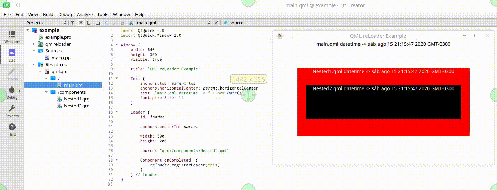

# QML reLoader


English | [Português (Brasil)](./README.pt_BR.md)

### Overview
The **QML reLoader** allows developers to quickly reload the user interface on every document save by watching the hierarchy of loaded files when using the Qt's Loader component. The main difference between this and other solutions is that we will not reload the entire application, but only the parts that have been changed (and their dependencies). It is aimed to speed up development in small to big projects.

It supports Linux, macOS and Windows. It has been tested with Qt 5.12 through 5.15. MIT Licensed.


## Demo




## How to use it

There are three steps:

**1:** Add the folder **qmlreloader/** to your project and include the **qmlreloader.pri** in your ".pro"ject file:


```qmake
QT += quick

CONFIG += c++11 silent

INCLUDEPATH += $$PWD

SOURCES += \
    $$PWD/main.cpp

RESOURCES += \
    $$PWD/qml.qrc

# QML reLoader
include($$PWD/../qmlreloader/qmlreloader.pri)```
```


**2:** Include the header **qmlreloader.h** in your main.cpp, and after the Engine declaration, register it with the *QML reLoader*:

```c++
#include <QGuiApplication>
#include <QQmlApplicationEngine>

/// Include the header
#include "qmlreloader.h"

int main(int argc, char *argv[])
{
    QCoreApplication::setAttribute(Qt::AA_EnableHighDpiScaling);

    QGuiApplication app(argc, argv);

    QQmlApplicationEngine engine;
    
    /// Register the engine within QML reLoader
    QMLreLoader::QMLreLoader reloader(&engine);

    const QUrl url(QStringLiteral("qrc:/main.qml"));
    QObject::connect(&engine, &QQmlApplicationEngine::objectCreated,
        &app, [url](QObject *obj, const QUrl &objUrl) {
            if (!obj && url == objUrl)
                QCoreApplication::exit(-1);
        }, Qt::QueuedConnection);
    engine.load(url);

    return app.exec();
}
```

**3:** On every usage of the traditional *Qt QML Loader*, register it within *QML reLoader* on the *Component.onCompleted {}* signal, and you're done:

```qml
Loader {
    id: loadCRM

    anchors.fill: parent
    source: "qrc:/modules/crm/StartCRM.qml"

    Component.onCompleted: {
        reloader.registerLoader(loadCRM); // this loader will now be monitored
    }
}
```

Copyright (c) 2020 Arthur Turrini.

